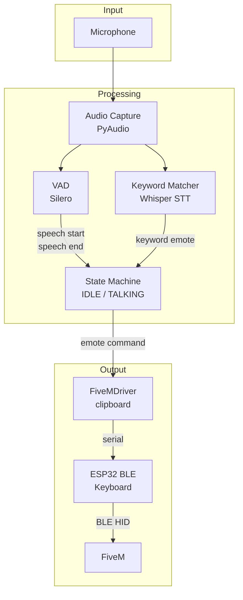
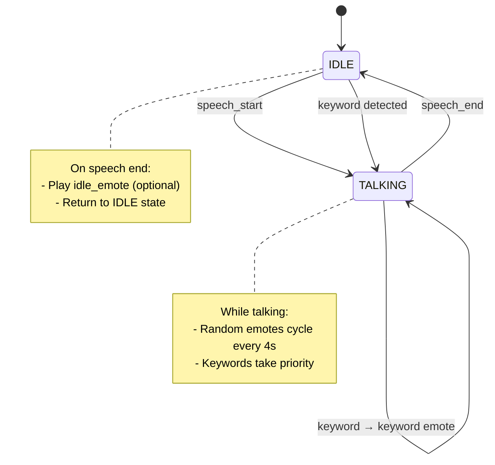
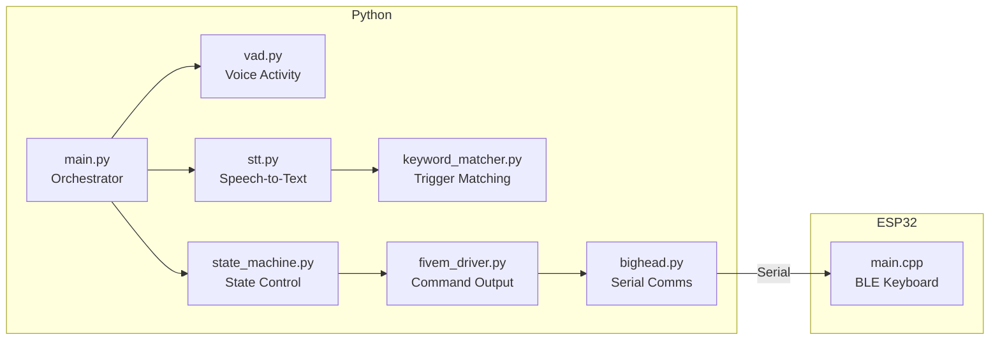
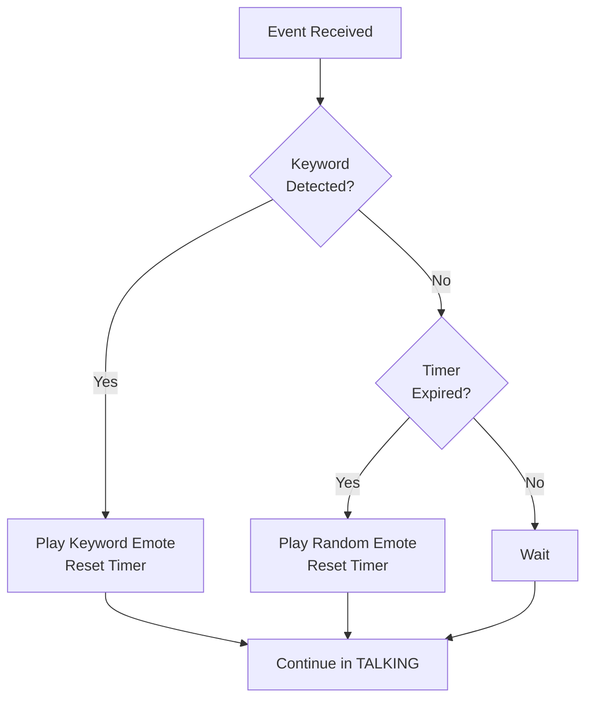

# Architecture

## System Overview

## Data Flow

1. **Audio Capture**: PyAudio captures microphone input in real-time
2. **Dual Processing**: Audio is processed by both VAD and STT simultaneously
   - **VAD (Silero)**: Detects speech start/end events
   - **STT (Whisper)**: Transcribes speech and matches keywords
3. **State Machine**: Receives events from both processors and decides which emote to trigger
4. **Output Chain**: Emote commands flow through FiveMDriver → ESP32 → FiveM

## State Machine

## Component Responsibilities

## Emote Priority

